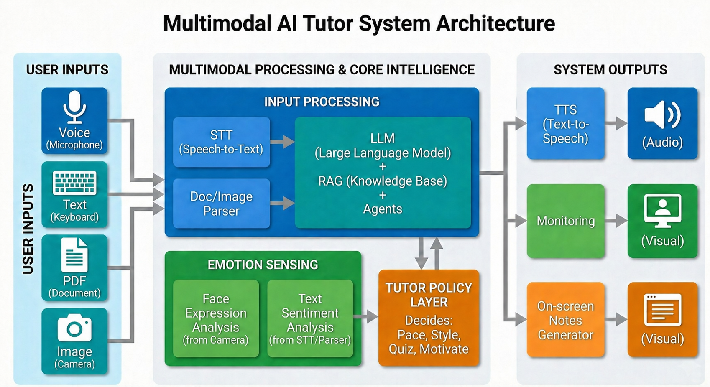

# Affective Intelligence-Driven Personalized AI Tutoring System

> A multimodal, emotion-aware tutoring research prototype that adapts its
> instructional strategy according to learner state and engagement.

## Overview

This repository contains a public, sanitized research implementation of an
affective-intelligence-driven personalized AI tutoring system developed during
a remote research internship with Newcastle University in Singapore under the
supervision of Dr. Anurag Sharma.

The system combines LLM-based explanation, adaptive tutoring, learner-state
modeling, empathy-aware response generation, and monitoring-informed
re-engagement to support personalized learning.

## Explore the Project

[Complete Demonstration](https://github.com/swaran-venkitesh/affective-ai-tutoring-system/releases/latest)
· [System Architecture](#system-architecture)
· [Emotion Engine Architecture](EMOTION_ENGINE_ARCHITECTURE.md)
· [Implementation Details](EMOTION_ENGINE_IMPLEMENTATION.md)

## System Architecture

The architecture connects voice, text, document, and image inputs with
LLM-based tutoring, retrieval, multimodal emotion sensing, adaptive tutor
policy, monitoring, speech output, and on-screen study materials.

## Complete System Demonstration

The complete demonstration presents the current working implementation,
including conversational tutoring, adaptive explanations, quiz generation,
engagement monitoring, supportive interventions, session analytics, and
automatic generation and email delivery of study materials.

[▶ Watch the complete system demonstration](https://github.com/swaran-venkitesh/affective-ai-tutoring-system/releases/latest)

**Duration:** 4 minutes 31 seconds  
**Resolution:** 1920 × 1080  
**Format:** H.264 MP4

## Core Capabilities

| Area | Capability |
|---|---|
| Adaptive tutoring | LLM-based concept explanations tailored to the learner's needs |
| Learner-state modeling | Tracks confusion, frustration, engagement, attention, and self-doubt |
| Confusion handling | Distinguishes productive confusion from harmful or prolonged confusion |
| Selective empathy | Activates supportive intervention when affect is likely to disrupt learning |
| Instructional support | Provides hints, worked examples, step-by-step guidance, and simpler re-explanations |
| Engagement monitoring | Uses attention drop, sleepiness, phone usage, and looking-away indicators |
| Comparative evaluation | Supports baseline versus emotion-enabled tutoring assessment |
| Feedback analysis | Examines clarity, confidence, empathy, frustration reduction, and monitoring acceptability |

## Research Motivation

Conventional AI tutors can provide correct answers but may fail to recognize
when a learner is confused, frustrated, disengaged, or losing confidence.

This project investigates how affective intelligence can help an AI tutor
respond more appropriately to a learner's emotional and cognitive state while
avoiding unnecessary or excessive interventions.

## Technology Stack

| Area | Technologies and Methods |
|---|---|
| Core development | Python, Flask, and backend APIs |
| Generative AI | LLM integration and prompt engineering |
| Affective intelligence | Emotion modeling and learner-state tracking |
| Multimodal monitoring | Computer-vision and engagement-monitoring support |
| Evaluation | Survey and feedback analysis |

## Research Status

This repository is a public technical showcase of the current research
prototype. It is intended for portfolio demonstration, technical review, and
research discussion.

## Responsible Sharing

This repository contains sanitized technical material. It does not include
confidential participant data, private API keys, institutional data, restricted
datasets, or unpublished manuscript content.

Some research-related components are omitted because they are associated with
collaborative or unpublished academic work.
